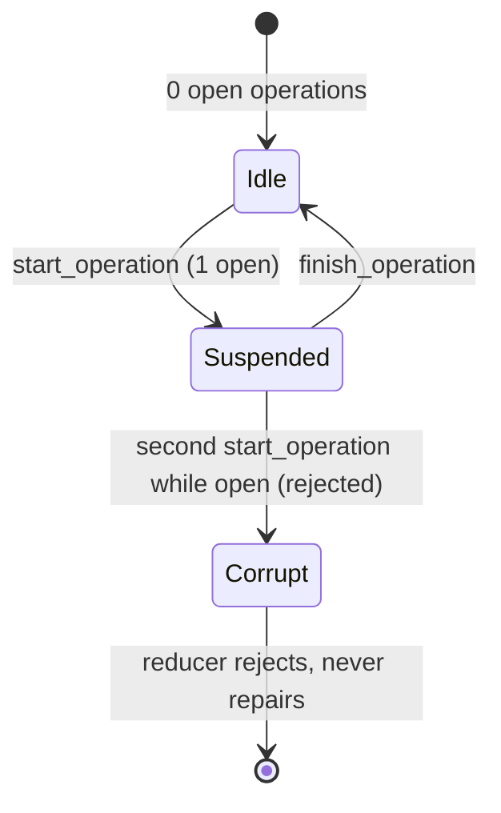

# Durable execution

bullpen's central design idea, adapted from [pi](https://github.com/earendil-works/pi)'s
`harness-v2.md` spec and realized in Rust here, is that **a session's execution
state is defined as the reduction of its records** — not held in memory, not
reconstructed from a UI. That single choice is what makes runs resumable after
a crash, a `kill -9`, or a power loss: the next invocation reads the store,
reduces, recovers if needed, and continues.

This page is the conceptual backbone. The implementation lives across
[`bullpen-store`](../crates/store.md) (the entries/records tables and
reduction), [`bullpen-agent`'s `Journal` trait](../crates/agent.md) (the
protocol), [`bullpen-harness`'s `StoreJournal`](../crates/harness.md) (the
SQLite implementation), and [`recovery`](../crates/recovery.md) (the procedure).

## Two kinds of state

A single SQLite database (`~/.bullpen/bullpen.db`, WAL mode) holds two kinds of
per-session state, sharing one monotonic `seq` allocated inside each write:

**Entries** are the conversation: an append-only tree per session
(`id`/`parent_id`), where each lane has a leaf pointer. Entries are what the
model sees; rebuilding provider context walks leaf → root. The tree never
contains orchestration state.

**Records** are execution: a flat per-session log
(`operation_started`, `step_attempt`, `tool_started`, `operation_finished`)
that nothing reads during normal execution. Records never enter model context.
Deleting every record leaves a complete, valid conversation.

Callers never see or pass sequence numbers or parent ids — both are allocated
inside the storage write. See [`bullpen-store`](../crates/store.md) for the
schema and the idempotent `append_entry`/`append_record` operations.

## The durability rule

> Before an effect: write an intent record naming what will happen and the ids
> it will produce. After the effect: append the result as an entry with exactly
> those ids.

There is **no multi-row atomicity and none is needed** — every record and
entry is durable alone. An intent is fulfilled iff an entry with its
provisioned id exists. Appends are idempotent (`append-if-missing` on the
provisioned id), so re-running recovery is always safe.

A journal write failure fails the run — durability is not best-effort. Results
are grouped in one entry per batch (matching the in-memory message shape); the
cost is that a crash mid-batch loses the whole batch's results to synthesis.
Acceptable at serial tool execution; revisit with parallel scheduling.

## The `Journal` protocol

The loop reports every step of a run through the `Journal` trait in
intent-order. The loop knows the protocol; it does not know the storage —
`NullJournal` runs everything in memory, `StoreJournal` provides the
SQLite-backed implementation.

```text
run_started        op record + user entry
  step_attempt     durable attempt counter (a crash-restart loop cannot reset it)
  assistant_message  entry
  tool_batch       one intent record per call, all sharing one provisioned
                   results-entry id + a snapshot of each tool's replay safety
  tool_results     the provisioned grouped results entry
run_finished       op record (completed | failed | truncated | aborted)
```

The `tool_batch` hook is the heart of the durability rule: it writes one
`tool_started` record per intent, each carrying the shared `results_entry_id`
the batch's grouped results will later be appended at. Recovery pairs
unfulfilled intents to that id to synthesize their interrupted results.

See [the agent loop](../crates/agent.md) for the `Journal`/`NullJournal`
definitions and [the harness](../crates/harness.md) for `StoreJournal`.

## Reduction: deriving execution state from records

A session's execution state is **defined** as the reduction of its records:



`Store::open_run` is the reducer: it counts `operation_started` records with no
matching `operation_finished`. Zero → idle (`None`); exactly one → suspended
(`Some(OpenRun)`); two or more → `Corrupt` (single-writer states only; the
reducer rejects, never repairs). A second `start_operation` while one is open
is refused outright, not silently allowed.

## Recovery

Recovery runs automatically before using a session with an open operation (in
`harness::prepare_session`). It reads the open run's records and the entry path
back to the run's source leaf, then:

1. For each unfulfilled tool batch (its `results_entry_id` not present in
   `entries`), appends a synthetic `interrupted` tool-results entry at that
   provisioned id — one `ToolResult { is_error: true }` per intent.
2. If the transcript would otherwise end on a user message (a prompt or
   synthesized results), appends a closing assistant note so the next run
   never produces two consecutive user turns.
3. Writes `operation_finished(aborted)` and clears the lane's open-operation
   marker.

Conservative v1 choice: replay-safe tools are **not** re-executed on recovery;
everything unfulfilled synthesizes as interrupted. The replay declaration is
snapshotted in the intent record now so re-execution can be added without a
schema change. Every append is idempotent on its provisioned id, so re-running
recovery after a crash *during* recovery is safe.

See [recovery](../crates/recovery.md) for the procedure and its tests.

## Rules carried forward

- **Append-only context**: provider context only grows at the tail within a
  lane; inserting earlier silently invalidates provider KV cache.
- **Never persist partial provider streams** — retry or abandon. The Anthropic
  adapter abandons a mid-stream failure rather than retrying it.
- **Deterministic child ids** for the pen: a subagent's session id derives from
  `f(parent_session, tool_call_id)`, so a replayed spawn reattaches instead of
  spawning a twin. See [the pen](../crates/pen.md).
- **Lanes**: schema carries a lane name (default `main`) from day one;
  multi-lane execution arrives with the pen.
- **Usage stays a side channel** (session totals today, a ledger later);
  reduction and recovery never read it.
