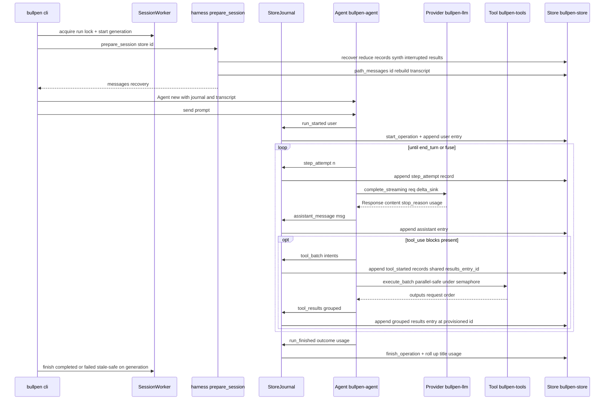

# bullpen architecture

bullpen is a durable agent harness in Rust. The name is the thesis: a bullpen is
a roster of warmed-up relievers you call in, pull back, and send out again —
agents as managed, durable workers rather than fire-and-forget processes.

## Three commitments

| | Commitment | What it rules out |
|---|---|---|
| 1 | **One durable store.** A single SQLite database (WAL) holds every session, agent run, and workflow step — cross-process safe, resumable by design | State that dies with the process, and JSON files that lose concurrent writes |
| 2 | **Real confinement.** OS-level sandboxing (Seatbelt on macOS, Landlock intended on Linux) with a capability model resolved per tool call | Approval prompts as the only boundary — friction, not authorization |
| 3 | **Durable orchestration.** Workflow steps persisted and resumable from any point, not held in a UI | A checklist that exists only while something is watching it |

## The policy-free core loop

The core loop stays policy-free: `bullpen-agent` knows nothing about vendors,
config, or UI. Everything else composes around it at the edge — through
interfaces and events, not by editing the loop. This principle (adapted from
[neo](https://github.com/owainlewis/neo)) is what makes the crate map below
enforceable: if a feature needs the loop changed, that is a design smell to
justify explicitly.

## Crate map and dependency direction

Dependency direction is enforced by the workspace — a crate may only depend on
crates above it in this table:

| Crate | Owns | Must never know about |
|---|---|---|
| [`bullpen-llm`](../crates/llm.md) | Provider-neutral conversation types, `Provider` trait, wire-format adapters, shared retry policy | Tools, transcripts, UI |
| [`bullpen-auth`](../crates/auth.md) | Credential store, PKCE, OpenRouter OAuth, Codex device-code + refresh, read-only borrow of `~/.codex/auth.json` | Tools, the loop, UI |
| [`bullpen-tools`](../crates/tools.md) | `Tool` trait, `Registry`, built-ins (bash, hashline read/write/edit, grep, glob, ask, ast_grep/ast_edit, github), parallel-safety flags | Providers, the loop |
| [`bullpen-store`](../crates/store.md) | SQLite persistence: sessions, transcripts, usage, todos; schema migrations via `user_version`; `pid_alive` | Providers, tools, the loop |
| [`bullpen-agent`](../crates/agent.md) | The loop: transcript, provider calls, tool continuation, events, max-turns fuse, the `Journal` durability protocol (trait only) | Config files, sessions, vendors, UI, storage |
| [`bullpen-harness`](../crates/harness.md) | Durable execution: `StoreJournal`, crash recovery orchestration, the pen, `job`, `todo`, worktree placement | Vendors, UI |
| `bullpen` ([cli](../crates/cli.md)) | Composition root: wiring, system prompt, headless `run`, `sessions` | — (the only crate that knows everything) |

`bullpen-sandbox` ([sandbox](../crates/sandbox.md)) is a leaf dependency of
`bullpen-tools` and the CLI; it knows nothing about the loop or providers.

## Runtime call sequence of one turn

The diagram below traces one `bullpen run "..."` turn across the crates. The
agent loop drives provider calls and tool execution; durability is reported
through the `Journal` to `StoreJournal`, which writes intent records before
effects and result entries after. See [durable execution](durable-execution.md)
for the protocol and [the agent loop](../crates/agent.md) for the loop body.

## Where to go next

- For the durability protocol, reduction, and recovery: [durable execution](durable-execution.md).
- For the conversation wire types and providers: [llm](../crates/llm.md) and
  the per-adapter pages it links.
- For crash recovery specifically: [recovery](../crates/recovery.md).
- For the pen (durable subagents, worktree isolation, background dispatch):
  [pen](../crates/pen.md).
- For the job coordination tool: [job](../crates/job.md).
- For the durable session plan: [todo](../crates/todo.md).
- For the CLI that wires it all together: [cli](../crates/cli.md).
- For first-time orientation and task routing: [quickstart](../quickstart.md).
