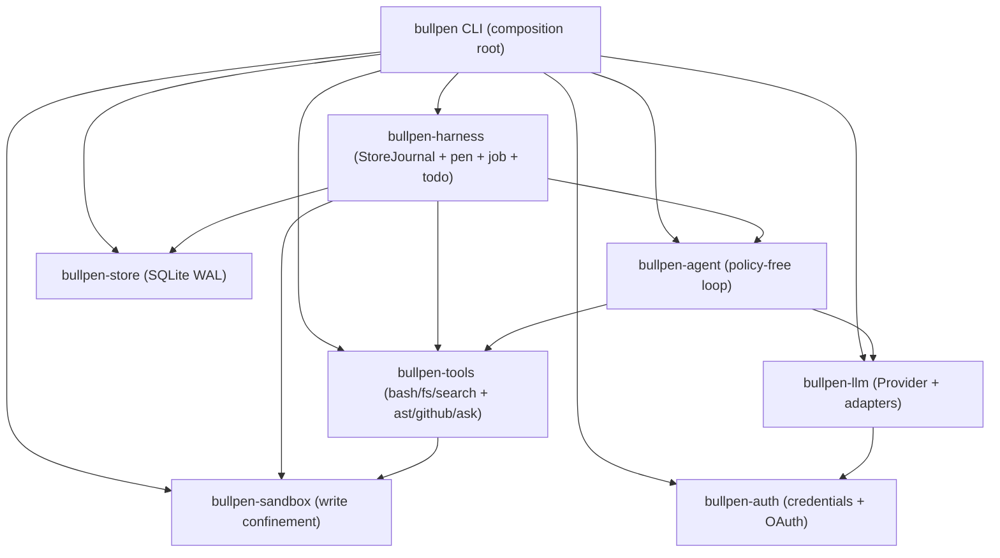

# bullpen wiki — quickstart

**bullpen** is a durable agent harness in Rust: agents as managed, resumable
workers — not fire-and-forget processes. Three commitments shape the design:

1. **One durable store.** A single SQLite database (WAL) holds every session,
   agent run, and workflow step — cross-process safe, resumable by design.
2. **Real confinement.** OS-level sandboxing (Seatbelt on macOS, Landlock
   intended on Linux) with a capability model resolved per tool call.
3. **Durable orchestration.** Workflow steps persisted and resumable from any
   point (planned; M5).

The core loop stays **policy-free**: `bullpen-agent` knows nothing about
vendors, config, or UI. Everything else composes around it at the edge.

## High-level map

Dependency direction is enforced by the workspace — a crate may only depend
on crates above it in this table (from `ARCHITECTURE.md`):

| Crate | Owns | Must never know about |
|---|---|---|
| `bullpen-llm` | Provider-neutral conversation types, `Provider` trait, wire-format adapters, shared retry | Tools, transcripts, UI |
| `bullpen-auth` | Credential store, PKCE, OpenRouter OAuth, Codex device-code + refresh, Codex CLI borrow | Tools, the loop, UI |
| `bullpen-tools` | `Tool` trait, `Registry`, built-ins (bash, hashline read/write/edit, grep, glob, ast_grep/ast_edit, github, ask), parallel-safety flags | Providers, the loop |
| `bullpen-store` | SQLite persistence: sessions, transcripts, usage, todos; schema migrations; `pid_alive` | Providers, tools, the loop |
| `bullpen-agent` | The loop: transcript, provider calls, tool continuation, events, max-turns fuse, `Journal` trait | Config, sessions, vendors, UI, storage |
| `bullpen-harness` | `StoreJournal` (implements `Journal` over the store), crash recovery, the pen, `job`, `todo`, worktree placement | Vendors, UI |
| `bullpen` (cli) | Composition root: wiring, system prompt, `run`, `sessions` | — (the only crate that knows everything) |

## Major concepts

- [Architecture overview](architecture/overview.md) — the policy-free core
  loop and the three commitments.
- [Durable execution](architecture/durable-execution.md) — the durability
  rule, the entry/record split, reduction and recovery.
- [Transcript invariants](concepts/transcript-invariants.md) — every
  `tool_use` gets one paired `tool_result`; structural validity after the
  fuse and after recovery.
- [Event and streaming model](concepts/event-and-streaming-model.md) —
  `Event` out, assistant text on a separate `TextSink`.
- [Providers and auth](concepts/providers-and-auth.md) — the five-provider
  selection matrix and the two credential shapes.

## Crates

- [`bullpen-llm`](crates/llm.md) — shared conversation types, `Provider`
  trait, retry/SSE helpers.
  - [`Anthropic` adapter](crates/anthropic-adapter.md) (Anthropic + GLM + Kimi).
  - [`Codex` adapter](crates/codex-adapter.md) (OpenAI Responses/SSE).
  - [`ChatCompletions` adapter](crates/chatcompletions-adapter.md)
    (OpenRouter).
- [`bullpen-auth`](crates/auth.md) — `AuthFile`, OpenRouter PKCE, Codex
  device-code + two `TokenSource` impls.
- [`bullpen-tools`](crates/tools.md) — `Tool`/`Registry`, bash, hashline
  read/write/edit, grep/glob, `ast_grep`/`ast_edit`, `github`, `ask`.
- [`bullpen-sandbox`](crates/sandbox.md) — write confinement + Seatbelt.
- [`bullpen-store`](crates/store.md) — SQLite, schema v8, sessions/entries/records/todos.
  - [Crash recovery](crates/recovery.md).
  - [Session worker](crates/worker.md) — exclusive ownership + generation.
- [`bullpen-agent`](crates/agent.md) — the policy-free loop and `Journal` trait.
- [`bullpen-harness`](crates/harness.md) — `StoreJournal` + `prepare_session`.
  - [The pen](crates/pen.md) — durable subagents (worktree isolation +
    background dispatch).
  - [The `job` tool](crates/job.md) — coordination over background children.
  - [The `todo` tool](crates/todo.md) — durable session plan in the store.
  - [Worktree](crates/worktree.md) — per-session git worktrees (now in the
    harness).
- [`bullpen` CLI](crates/cli.md) — the composition root and `run`.
  - [`--json` NDJSON stream](crates/cli-run-json.md).
  - [Background dispatch + agents dashboard](crates/cli-background.md).

## Operations

- [Where state lives](operations/state-layout.md) — `$BULLPEN_HOME`,
  `bullpen.db`, `auth.json`, logs, worktrees.
- [Build, test, and CI](operations/build-test-ci.md) — the three gates,
  pinned toolchain, resource bounds.
- [Security posture](operations/security-posture.md) — sandboxing and the
  trust boundary.

## Task-routing table

| Change area / intent | Page | Owning entrypoints / symbols | Focused tests | Minimal validation |
|---|---|---|---|---|
| Add a provider (new wire format) | [llm](crates/llm.md), [adapter pages](crates/anthropic-adapter.md) | `Provider` trait, `to_wire`/`from_wire` | adapter `*_wire` unit tests | `cargo test -p bullpen-llm` |
| Add a provider (Anthropic-compatible host) | [anthropic adapter](crates/anthropic-adapter.md) | `Anthropic::new` + base_url/auth/model knobs | `request_wire_shape`, `caching_marks_system_prompt` | `cargo test -p bullpen-llm` |
| Add a tool | [tools](crates/tools.md) | `Tool` trait, `Registry::register`, `parallel_safe`/`replay_safe` | `registry_specs_sorted_and_complete` | `cargo test -p bullpen-tools` |
| Change the loop / transcript invariant | [agent](crates/agent.md), [invariants](concepts/transcript-invariants.md) | `Agent::drive`, `execute_batch`, `cap_result` | `tool_roundtrip_pairs_result_with_use`, `max_turns_fuse_trips` | `cargo test -p bullpen-agent` |
| Change durability protocol | [durable execution](architecture/durable-execution.md), [harness](crates/harness.md), [journal](crates/agent.md) | `Journal` trait, `StoreJournal`, `tool_batch`/`tool_results` | `full_run_is_durable_and_resumable`, `simulated_crash_mid_batch_recovers` | `cargo test -p bullpen-harness` |
| Change recovery | [recovery](crates/recovery.md), [durable execution](architecture/durable-execution.md) | `recover`, `open_run`, `finish_operation` | `recovers_crashed_batch_with_synthetic_results` | `cargo test -p bullpen-store` |
| Change session ownership / liveness | [worker](crates/worker.md), [store status](crates/store.md) | `SessionWorker::acquire`/`start`/`finish`, `start_worker`/`finish_worker`, `pid_alive` | `a_cli_owned_child_cannot_also_run_in_the_pen` | `cargo test -p bullpen-store -p bullpen-harness` |
| Change the pen / subagents | [pen](crates/pen.md) | `PenTool`, `child_session_id`, `place_child`, `Cancels` | `replay_reattaches_without_provider_calls`, `child_budget_is_durable` | `cargo test -p bullpen-harness` |
| Change the job tool | [job](crates/job.md) | `JobTool`, `for_session`, `answer_of` | `list_shows_the_completed_child_and_wait_returns_its_answer`, `reads_are_parallel_safe_cancel_is_not` | `cargo test -p bullpen-harness` |
| Change the todo tool / session plan | [todo](crates/todo.md), [store todos](crates/store.md) | `TodoTool`, `todo_id`, `add_todo`/`set_todo_status` | `only_one_todo_is_ever_in_progress`, `replayed_add_does_not_duplicate` | `cargo test -p bullpen-harness` |
| Change read_file (hashline/SQLite/archive/URL) | [tools](crates/tools.md) | `ReadFile`, `line_hash`, `hashlines`, `sqlite::read_sqlite`, `archive::detect` | `a_sqlite_database_reads_as_schema_then_queries`, `an_archive_reads_as_a_listing_then_an_entry`, `urls_fetch_through_the_same_path` | `cargo test -p bullpen-tools` |
| Change edit_file (hashline patch) | [tools](crates/tools.md) | `EditFile`, `parse_hunks`, `resolve_anchor`, `parse_anchor` | `patch_applies_replace_insert_and_delete_in_one_call`, `a_moved_anchor_is_followed_by_its_hash`, `a_changed_anchor_fails_with_fresh_context` | `cargo test -p bullpen-tools` |
| Change sandbox / confinement | [sandbox](crates/sandbox.md), [security](operations/security-posture.md) | `Sandbox::allows_write`, `wrap_bash`, `seatbelt_profile` | `allows_writes_inside_workspace_denies_outside`, `symlink_escape_is_denied` | `cargo test -p bullpen-sandbox -p bullpen-tools` |
| Change CLI run / flags | [cli](crates/cli.md) | `run`, `build_provider`, `system_prompt`, `TtyAsker` | `sessions_json` tests | `cargo test -p bullpen` |
| Change `--json` wire | [cli-run-json](crates/cli-run-json.md) | `event_json`, `result_json`, `dispatched_json` | `event_kinds_are_stable_wire_strings`, cap tests | `cargo test -p bullpen` |
| Change background / dashboard | [cli-background](crates/cli-background.md) | `bg::spawn_detached`, `agents::run`, `dispatch` | `background_lifecycle.rs` | `cargo test -p bullpen --test background_lifecycle` |
| Change worktree / resume location | [worktree](crates/worktree.md) | `decide`, `locate`, `git_write_roots`, `worktree_path_for_store` | `decide` table tests, `init_repo` tests | `cargo test -p bullpen-harness` |
| Change auth / login | [auth](crates/auth.md), [providers](concepts/providers-and-auth.md) | `AuthFile`, `CodexAuth::login`, `openrouter::exchange` | `roundtrip_and_missing_file`, `store_is_owner_only`, `rfc7636_test_vector` | `cargo test -p bullpen-auth` |
| Change schema / migrations | [store](crates/store.md) | `Store::migrate`, `user_version` | `migrates_v2_*`, `migrates_v5_*`, `migrates_v7_sessions_adding_todos` | `cargo test -p bullpen-store` |

For the whole workspace: `cargo test --workspace`,
`cargo clippy --workspace --all-targets -- -D warnings`,
`cargo fmt --all --check` (all three gate CI on Linux and macOS — see
[build-test-ci](operations/build-test-ci.md)).

## Backlog (deferred / out of scope)

- **`.pi-subagents/` and `conversation_history/`** — runtime agent artifacts,
  not source. Anchors: `/.pi-subagents/artifacts/`,
  `/conversation_history/`. Reason: not part of the product code.
- **`docs/plans/`** — planning/design docs, not runtime code. The two
  markdown plans (`2026-08-07-001-docs-agent-view-claim-correction-plan.md`,
  correcting the `ARCHITECTURE.md` M4 Claude Code comparison;
  `2026-08-12-002-agent-view-stage2-handoff.md`, `status: ready`, tracking
  the committed Stage 2 durable session inbox foundation) are the source for
  roadmap claims already reflected in the [cli-background](crates/cli-background.md)
  page and `ARCHITECTURE.md`; they are cited there rather than given their own
  page. Anchor: `/docs/plans/`.
- **`docs/TOOLS.md`** — the tool-surface roadmap doc (shipped tools, the bar
  for a new tool, what's next). Referenced from [tools](crates/tools.md);
  not given its own page. Anchor: `/docs/TOOLS.md`.
- **`docs/media/bullpen-agents.tape`** — VHS demo tape; referenced from
  [build-test-ci](operations/build-test-ci.md).
- **M5 workflow engine** — durable steps in SQLite, deterministic
  orchestration over pen agents, resume from any step. Planned, not
  implemented (see `ARCHITECTURE.md` roadmap and
  [architecture overview](architecture/overview.md)).
- **Landlock Linux shell confinement** — intended, not implemented; the
  in-process write check already works on Linux (see [sandbox](crates/sandbox.md)).
- **Stage 2 agent view** — interactive attach to/detach from a live process,
  needs-input state, notifications. Committed but not shipped; see
  [cli-background](crates/cli-background.md) and the Stage 2 handoff plan
  in `docs/plans/`.
- **Cross-process `job` cancel** — today `cancel` reaches only background
  children dispatched by the calling process (in-process cooperative
  cancellation). Signalling a child owned by another process needs a
  protocol for that process to finish its session cleanly; see the
  "Coordination leftovers" note in `docs/TOOLS.md`.
